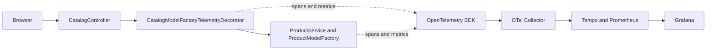

## Observability Architecture Notes

### Instrumented Flow

What helped most is that the project already has a readable structure, and the main user flow is concentrated in a few important places. Because of that, I could add tracing in a targeted way, mainly through decorators, instead of changing the business logic itself.

What made it harder is that some factory methods do too much at once, so the natural observability boundaries are not always clear. The architecture also does not treat observability as a first-class concern, which means those seams had to be introduced carefully. A final issue is label design: in this kind of system, it is very easy to add attributes that later become high-cardinality noise.

My main takeaway is that the architecture is good enough to support observability improvements, but only with small surgical changes, not deep architectural ones.

### Dashboard Screenshots

These Grafana screenshots show the dashboard used to observe the `Catalogue -> Search -> Pricing` flow during the demo.

#### Overview

#### Example under load

