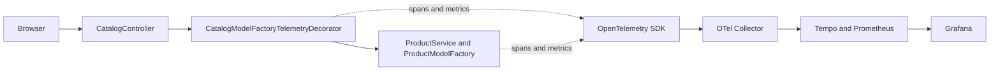

## Observability Architecture Notes

### Instrumented Flow

nopCommerce still helped this observability work in one important way: the storefront flow I chose is concentrated around a few orchestration points that still carry business meaning. `CatalogModelFactory`, `ProductModelFactory`, `ProductService`, and the active search provider sit close to what the customer is actually doing, so telemetry can describe search execution, zero-result outcomes, browse behavior, pricing work, and product-page assembly instead of only reporting generic request timing. That made it possible to instrument useful signals without rewriting the whole flow. The trade-off is that the same concentration of logic also exposes how much work is packed into broad factory methods. Pricing, media, attributes, reviews, and plugin-driven behavior still meet inside large orchestration paths, so observability is feasible there but not naturally clean: traces help narrow the problem, but they do not fully remove ambiguity when one of those sub-steps regresses.

One part of the earlier critique now needs updating: observability is no longer only a future architectural recommendation. The implementation has already started moving toward clearer telemetry boundaries through targeted decorators and wrappers around catalog model preparation, product model preparation, product search execution, and search providers, with shared conventions for activity names, tags, and exception marking. That is a better long-term direction because it keeps instrumentation close to business operations while avoiding scattered tracing code inside every downstream method. Even so, the design is still incomplete. The product-details duration metric still carries `product.id`, which is too high-cardinality for a durable metric label, and some broader tracing choices can drift beyond the core `Catalogue -> Search -> Pricing` flow unless they are justified carefully.

The most surgical decision is still to observe existing seams instead of refactoring the storefront flow just to make it easier to measure. Earlier that mainly meant decorators around the model factories; after the newer changes it more accurately means a mix of decorators and DI-level wrapper boundaries around the search and product-preparation path. That remains the right trade-off for this assignment: it preserves domain meaning, keeps code churn contained, and makes the dashboard easier to explain. The remaining architectural weakness is not that the system lacks telemetry hooks, but that the underlying orchestration is still dense enough that contributors need clear conventions to avoid noisy spans, overlapping instrumentation, or labels that are too expensive to keep.
